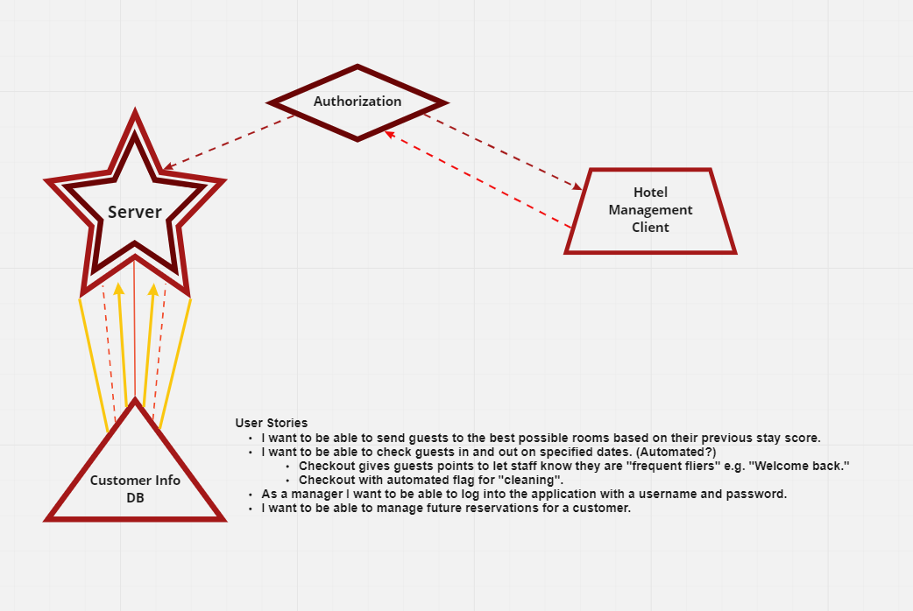

# hotel-management
Management system for a hotel.

### Authors

**Michael Hendrix**, **Jacob Choi**, **Señor Joey Hernandez**, **Ryan Lee**

### Installation

**Step One**

- begin by running:

`git clone `

- Also run this as well:

`git clone`

**Step Two**

- run: `cd hotel-management` then: `npm install`

`npm i express cors dotenv mongoose jwt bcrypt base-64 supertest sqlite3 jsonwebtoken`

- repeat step two for **'helphotel-client'**

### How to Use

**To start server**

- run: `npm start`

**To test the server**

- run: `npm run test`

### Models

**Guest**

'Guest', { username: string, required, description: string, required, }

**Concierge**

'Concierge', { name: string, required, description: string, required, }

# hotel-management

Management system for a hotel.

*H-otel Management*

An application for management of a large hotel.

Problem/Pain Point - Management of rooms, reservations, "cleaning" schedule.

MVP - Check someone in.

  Authorization for managers.
  Manage rooms.
  Make and confirm reservation.
  
**User Stories** - "As a manager..."

- I want to be able to send guests to the worst possible rooms based on their ‘evil’ score.
- I want to be able to check guests in and out on specified dates. (Automated?)
    - Checkout gives guests points to let staff know they are "frequent fliers" e.g. "Welcome back."
    - Checkout with automated flag for "cleaning".
- As a manager I want to be able to log into the application with a username and password.
- I want to be able to manage future reservations for a customer.

  
Stress Goals
1. Billing
2. Reward points
3. Reserve the "amenities"
- I want to be able to reserve amenities for guests.
4. Room service

## Domain Modeling

Being updated
https://miro.com/app/board/uXjVOP31-OE=/

File Structure
https://miro.com/app/board/uXjVOPdpmww=/

# Database Schema

This will be asked by the manager and filled into the application for storage.

Customer Info

Name: STRING

Phone: STRING

Room Assigned: STRING

Experience Score: NUMBER

Active: BOOLEAN

### Features

### Deployed Server

### Change Log

### Error Handling

- sends a 404 error if the route or method is unavailable.

### Testing

### Credit and Co-Conspirators