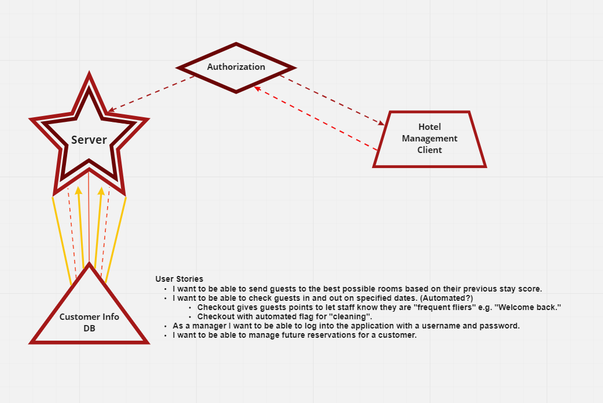

# Requirements

### What is the vision of this project?

A working a hotel management app that runs well and tracks and accounts for customers and rooms.

### What pain point does this project solve?

Solves the difficulty and logistics of managing a large scale hotel.

### Why should we care about your product?

Logistical management is necessary in order to manage a business.

## Scope (In/Out)

**IN - What will your product do**

Authorize users (management)
Make reservations
Fill in answers from customers asked by front desk staff
Manage rooms

**User Stories** - "As a manager..."

- I want to be able to send guests to the worst possible rooms based on their ‘evil’ score.
- I want to be able to check guests in and out on specified dates. (Automated?)
    - Checkout gives guests points to let staff know they are "frequent fliers" e.g. "Welcome back."
    - Checkout with automated flag for "cleaning".
- As a manager I want to be able to log into the application with a username and password.
- I want to be able to manage future reservations for a customer.

**OUT - What will your product not do.**

Product is not for average consumer use.
Will not be a mobile application.

## Minimum Viable Product vs

MVP will be:

1) Check a guest in
2) Check a guest out and add points for "experience"
3) After checkout, flag room for cleaning
4) Manage room availability with reservations
5) Managers can log in with a username and pw.

## What are your stretch goals?

Stretch
1. Billing
2. Reward points
3. Reserve the "amenities"
- I want to be able to reserve amenities for guests.
4. Room service

## Functional Requirements
List the functionality of your product. This will consist of tasks such as the following:

An manager can create and delete user accounts
A manager can update customer's profile information
A manager can search to see what rooms are available and when.

Data Flow

## Non-functional requirements

## Security - Authorization for management

Management must be able to log in with a username and password to manage the application.

## Testing

Automated testing with JEST will ensure these features are functional.

- Can create account
- Can log in
- Can input customer info
- Can give them a room
- Can reserve a room for future use
